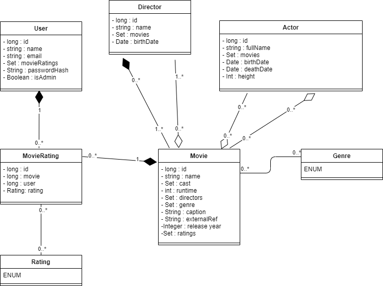

# PA165_2021

PA165 project at MUNI

## Local deployment

### Run the backend REST API

`mvn clean install -DskipTests && mvn -pl rest spring-boot:run`

### Run the frontend react server

Run `pushd webapp && ionic serve -p 8080 && popd` and navigate to `localhost:8080/pa165` in your browser - for optimal
results switch to mobile view via developer tools (press F12 in browser)

## Description

**_Movies Recommender Catalogue_** is a web application which provides a **catalogue** of movies and **recommendations**
for the user. Catalogue contains movies of different genres. User can like or dislike the movies they have watched. By
picking a movie, user gets the list of similar movies and movies that were liked the most by other users who watched the
same movie.

## Tests

Run unit test with:

```
$ mvn clean test
```

## Diagrams

### Use case diagram


### Class diagram


