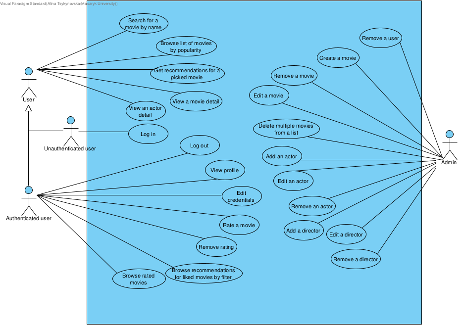

# PA165_2021
PA165 project at MUNI

## Description  

**_Movies Recommender Catalogue_** is a web application which provides a **catalogue** of movies and **recommendations** 
for the user. By picking a movie, user gets the list of similar movies and movies that were liked
the most by other users who watched the same movie. 

Catalogue contains movies of different genres. User can rate the movies according to various criteria (e.g., how novel are the ideas of the movie, their final score, etc.)

The application is written on Java, using Hibernate mapping tool, Maven build automation tool and Spring architecture.

## Diagrams
### Use case diagram

### Class diagram

